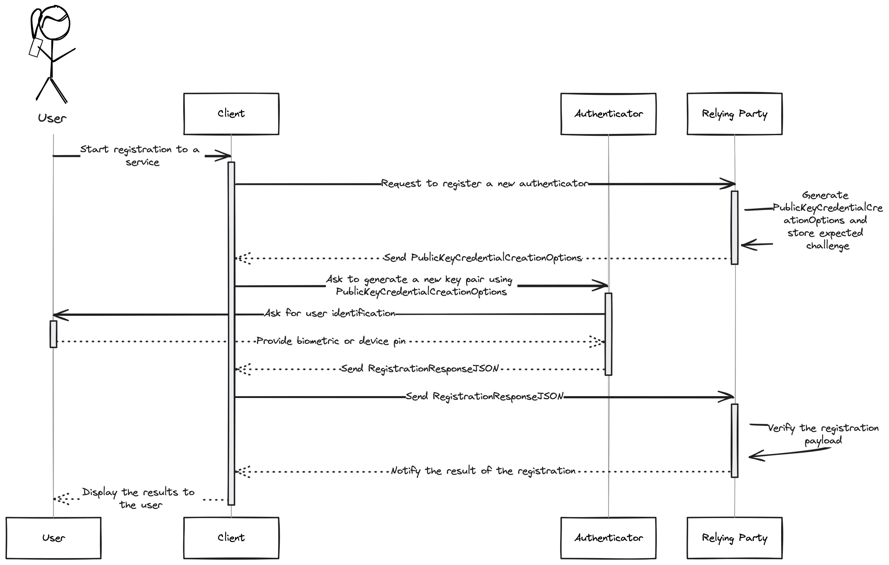
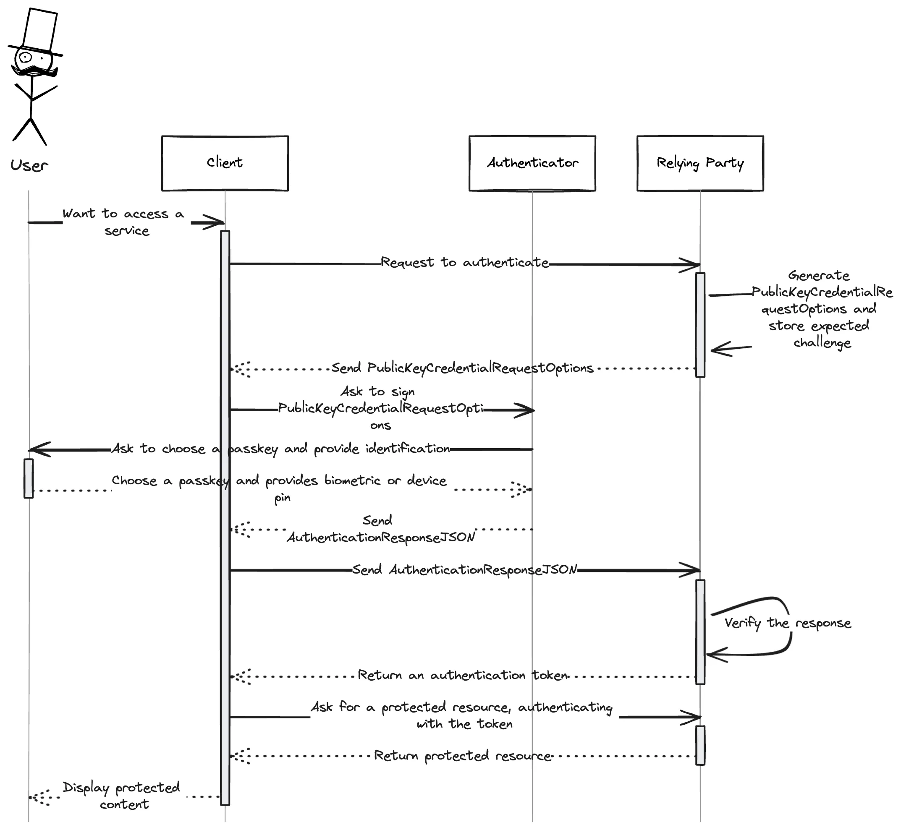

# Passkey Authentication in Flask

## TOC
- [Introduction](#Introduction)
- [WebAuthn](#WebAuthn)
- [Implementation](#Implementation)
- [License](#License)

# Introduction

This project serves as a reference to implementing the WebAuthn protocol as a Python flask backend.
It's a simple api that can be replicated to another language/framework following basic RESTful APIs structure.

The core logic resides within [services](./src/services) directory, the rest is just simple layering to expose the business logic to the users.

# WebAuthn

## Key Terminology

- **Relying party**: Your backend
- **Authenticator**: Either a software on a supported device (ex: windows machine with Windows Hello enabled and a [Trusted Platform Module](https://trustedcomputinggroup.org/resource/trusted-platform-module-tpm-summary/) hardware chip) which manages its user's passkeys and passwords (i.e: Google Password Manager, Windows Hello).
- **Client**: A user's browser or native app initiating the process.

## Process:

### Step 1: Registering an authenticator:



### Step 2: Passwordless authentication:



# Implementation

## Libraries used:

The project's code was built using the following packages:

* [webauthn](https://github.com/duo-labs/py_webauthn)
* [flask](https://flask.palletsprojects.com/en/stable/)
* [flask-openapi3[async,dotenv,email,swagger,yaml]](https://luolingchun.github.io/flask-openapi3/v3.x/)
* [orjson](https://github.com/ijl/orjson)
* [python-dotenv](https://pypi.org/project/python-dotenv/)
* [pydantic](https://docs.pydantic.dev/latest/)

## Core classes:

### CredentialEntity:

The `CredentialEntity` class represents the passkey credentials proper to the user who initiated the WebAuthn flow on your backend.
You have to save this entity as separate table/document to have a per device setup *OR* integrate its fields into your **_User_** entity.

The class is used to store and verify the allowed/excluded credentials that the user can use within your system.

```py
from pydantic import BaseModel, Field


class CredentialEntity(BaseModel):
    id: str = Field(default="")
    user_id: str = Field(default="")
    credential_id: str = Field(default="")
    credential_public_key: str = Field(default="")
    sign_count: int = Field(default=0)
    credential_device_type: str = Field(default="")
    credential_backed_up: bool = Field(default=False)
    transports: list[str] = Field(default_factory=list)
````

### PasskeyVerifModel:

This is the DTO (data transfer object) you MUST use to facilitate the transfer of keys and/or data between your frontend (specifically the passkey authenticator) and your relying party.

It's composed of different classes to make it easier to just pass around as dictionaries or "STRINGIFY" it for convenience.

````python

from pydantic import BaseModel, Field


class PKResponseObj(BaseModel):
    attestationObject: str = Field(default="")
    clientDataJSON: str = Field(default="")
    transports: list[str] = Field(default_factory=list)
    authenticatorData: str = Field(default="")
    signature: str = Field(default="")
    userHandle: str = Field(default="")


class PKCredentialObj(BaseModel):
    id: str = Field(default="")
    rawId: str = Field(default="")
    response: PKResponseObj
    type: str = Field(default="")
    clientExtensionResults: dict
    authenticatorAttachment: str = Field(default="")

class PasskeyVerifModel(BaseModel):
    user_id: str = Field(default="")
    credential: PKCredentialObj
    expected_challenge: str = Field(default="")
````

# License

This project is licensed under the MIT permissible license, see [license](./LICENSE) for more info.